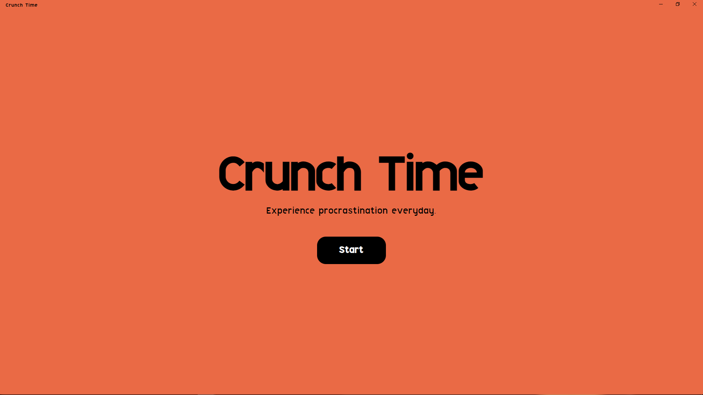

# Crunch Time

## Description

Crunch Time transforms procrastination and stress-related experiences into an engaging game. The game uses an alarm clock that has been adapted with an Arduino to communicate with the Electron game app interface. A blanket and pillow are also included in the game. Crunch Time is an interactive, initiative survival puzzle game in which the player must remember the 4-coded pin for the alarm clock. The player must lay down on their "bed" and wait for the alarm to ring to start the round. To acquire the correct pattern within a set length of time after it alerts, you must enter the 4 inputs. If the player correctly inputs the code within the time limit, the game loops back as the difficulty increases. If the player lost, the gaming interface displays the results of the match along with the number of rounds they completed and their best time.

## Requirements

- VSCode
- Latest NPM version
- PlatformIO
- Electron Forge

## Instructions

### How to use it?

## Components used.

## Circuit Schema

## Images

## Video

## Contributions

## Resources

### Arduino

### Electron

### 3D Printed Parts

## References